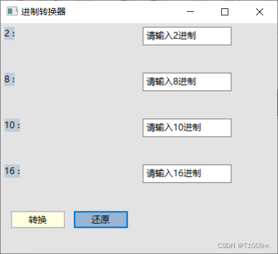

# binary-converter
wxformbuilder，wxpython实现的2-8-10-16进制转换器

**1.使用:**  运行mian.py

**2.转换器界面:**

  
  
**3.修改GUI界面:** 

  i.用wxformbuilder打开 ‘进制转换器.fbp’，进行修改，将wxformbuilder保存后py文件替换‘base_transf.py’
  
  ii.在‘base_transf.py’中修改

